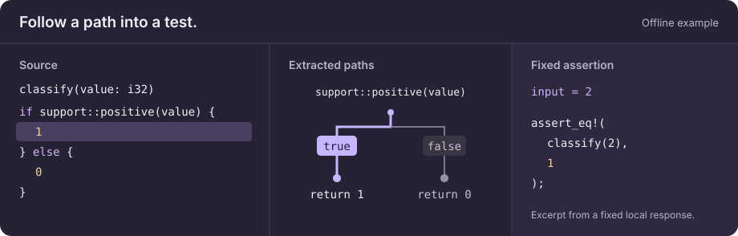
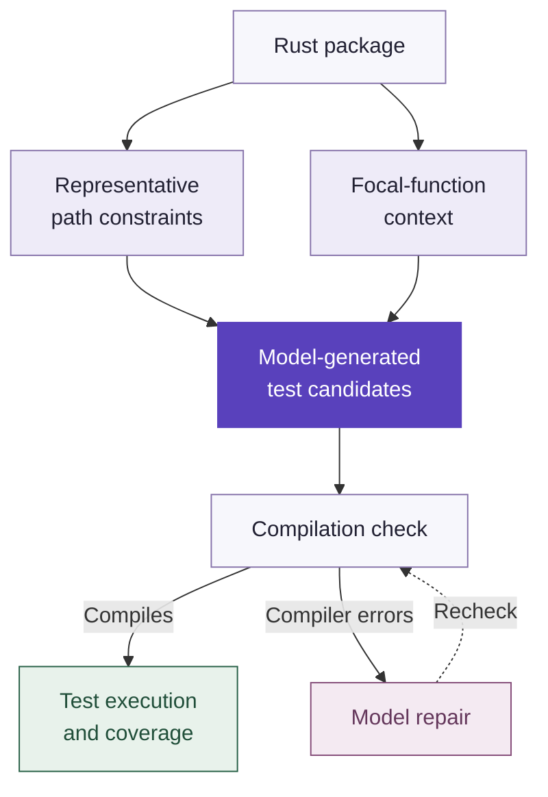

<h1 align="center"> PALM</h1>

<p align="center"><strong>Rust tests, guided by program analysis.</strong></p>

<p align="center">
  <a href="https://cppbear.github.io/PALM/"></a>
  <a href="LICENSE"></a>
  <a href="https://github.com/cppbear/PALM/actions/workflows/ci.yml"></a>
</p>

<p align="center">
  <a href="https://cppbear.github.io/PALM/">Website &amp; interactive demo</a> ·
  <a href="#quick-start">Quick start</a> ·
  <a href="https://doi.org/10.1109/ASE63991.2025.00223">Paper</a> ·
  <a href="docs/palm-rust-unit-test-generation.md">中文技术指南</a>
</p>

PALM generates Rust tests by combining program analysis with large language models. It extracts path constraints and code context, generates candidates, repairs compilation errors, and reports execution results and coverage with test code excluded.

This is the maintained implementation of the [ASE 2025 paper](#citation), with changes made after the paper's experiments.

<a href="https://cppbear.github.io/PALM/">
  <picture>
    <source media="(max-width: 600px)" srcset="docs/assets/palm-example-mobile.svg">
    
  </picture>
</a>

*Illustration of the [minimal offline fixture](examples/minimal/README.md), using fixed local responses. It does not measure model quality. [Explore both paths on the website](https://cppbear.github.io/PALM/).*

## Quick start

First complete the [prerequisites](#prerequisites): Git, Rust, a C linker, Python 3.9+, and the pinned analysis and coverage tools. Then run the minimal pipeline without API keys:

```sh
git clone https://github.com/cppbear/PALM.git
cd PALM
cargo build --workspace --locked
python3 scripts/check_minimal.py
```

The script works in temporary copies, prints their location, and finishes with:

```text
Minimal analysis/generation/repair/coverage checks passed.
```

See [minimal pipeline validation](docs/minimal-pipeline.md) for the checked scenarios. For a real model, [install PALM](#installation), [select a runtime configuration](utgen/README.md#prerequisites), and follow a [bounded example](examples/README.md).

## Prerequisites

Use a native build environment with Git, [rustup](https://rustup.rs/), stable Rust, a C linker, and Python 3.9 or later for the validation scripts. Tool and dependency downloads may require network access.

1. Install the pinned analysis toolchain and components:

   ```sh
   rustup toolchain install nightly-2025-03-19 --profile minimal \
     --component rust-src --component rustc-dev --component llvm-tools-preview --component rust-analyzer
   ```

2. Install [cargo-llvm-cov](https://github.com/taiki-e/cargo-llvm-cov):

   ```sh
   cargo +stable install cargo-llvm-cov --version 0.6.16 --locked
   ```

Use the same nightly for the target package. `rust-analyzer` provides editor support; compiler analysis uses components such as `rustc-dev`. Building, installation, and the offline checks need no model credentials.

[Continue with the quick start](#quick-start) once the prerequisites are installed.

## What PALM does

- Extracts representative path constraints and the focal function's dependencies for model prompts.
- Generates unit tests or integration tests, with explicit function selection and request budgets.
- Uses compiler diagnostics to repair candidates that do not compile.
- Reports compilation, execution, and coverage results for each focal function, preserving library/binary ownership.

## How it works



Repair addresses compilation errors. Runtime assertion failures and candidate timeouts remain failed test outcomes.

## A small example

The [minimal fixture](examples/minimal/README.md) includes this function, whose [support module](examples/minimal/src/support.rs) checks whether the input is positive:

```rust
pub fn classify(value: i32) -> i32 {
    if support::positive(value) {
        1
    } else {
        0
    }
}
```

The offline check supplies fixed local model responses with assertions for both paths. These excerpts omit the test wrappers and helper assertions:

```rust
assert_eq!(classify(2), 1);
assert_eq!(classify(-1), 0);
```

In a separate case, `nested::double` takes an `i32`. The check supplies an intentionally invalid candidate and a fixed repair response:

```diff
- assert_eq!(double("bad"), 4);
+ assert_eq!(double(2), 4);
```

The check validates compilation repair, execution, coverage, and source restoration with real Rust tools. Its fixed local responses do not measure model quality. [Explore the illustrated examples](https://cppbear.github.io/PALM/), [run the offline check](#quick-start), then use the [validation guide](docs/minimal-pipeline.md#outputs-and-coverage-interpretation) to interpret its output.

## Installation

From the repository root:

```sh
./install.sh
```

This installs brinfo, call_chain, focxt, and utgen. Ensure Cargo's binary directory, typically `$HOME/.cargo/bin`, is in `PATH`. The installer also works from another directory; `./install.sh --help` lists tool selection options. See [build and installation checks](docs/build-validation.md) for verification and the component READMEs below for individual installation commands.

Model configuration is loaded at runtime by `gen` and `fix`. Changing the API address, key, or model takes effect on the next command without rebuilding.

## Docker

Run `docker/docker-build`, then `docker/docker-run` to open a shell with the repository mounted at `/home/palm/palm`. Follow [Installation](#installation) inside the container. The image includes the pinned compiler and coverage tools; files written in the mounted repository remain on the host after the container exits.

Both scripts locate the repository from their own paths. See [Docker validation and CI scope](docs/build-validation.md#ci-and-further-checks) for the checked environment and optional container pipeline check.

## Workflow

Use a fresh working copy of the target package: preprocessing changes its source and test layout, and generation may add a test dependency.

1. Run `utgen pre-process`, then `utgen analyze` on that copy.
2. Generate candidates with `utgen gen --requirement --context`, using a function list and request cap for an initial trial.
3. Run `utgen fix` with the same function list and mode, then inspect request reports and per-function statistics.

Use `--integration` on both generation and repair commands for integration tests. The [examples](examples/README.md) provide complete commands for small unit, integration, and mixed-target trials. A completed command does not imply every candidate passed; [result fields](utgen/README.md#output) report the outcomes.

To measure existing tests, run `utgen coverage -p <original-crate-copy>` before preprocessing, on a separate copy. It needs no model configuration and retains `coverage.xml` and `coverage.json`.

## Supported scope

| Area | Current scope |
| --- | --- |
| Target package | One standalone Cargo package with ordinary lib/bin targets, including custom names and entry files. The complete workflow does not support multi-package workspaces. |
| Test modes | Unit tests use the recorded lib/bin target. Function-level integration tests require a library and compile-check external access. |
| Shared definitions | A definition compiled into both lib and bin is represented by lib. This does not test every binary variant. |
| Rust features | Analysis follows the active build configuration. There is no general macro expansion or automatic feature-matrix exploration. |
| Toolchain | `nightly-2025-03-19` and cargo-llvm-cov `0.6.16`. |
| Platforms | Full offline suite on Linux CI; exercised locally on macOS Apple Silicon. Windows has not been validated. |

See the [CLI reference](utgen/README.md) for source-processing boundaries, cache compatibility, timeouts, and coverage interpretation.

## Project Structure

| Directory | Purpose |
| --- | --- |
| [brinfo](brinfo/README.md) | Extract condition chains from HIR and MIR. |
| [focxt](focxt/README.md) | Construct context for each focal function. |
| [focxt/call_chain](focxt/call_chain/README.md) | Extract calls and type dependencies. |
| [utgen](utgen/README.md) | Generate, compile-check, repair, and evaluate tests. |
| [build-utils](build-utils/README.md) | Configure compiler library search paths during builds. |
| [examples](examples/README.md) | Minimal and mixed-target fixtures, plus the bundled bytes target. |
| [docs](docs/README.md) | Technical, usage, validation, and research documentation. |
| `docker/` | Container build and run scripts. |

## Development checks

```sh
cargo build --workspace --locked
cargo test --workspace --locked
```

Default checks use local model responses. See [CONTRIBUTING.md](CONTRIBUTING.md) for the regression check relevant to a change, and [build validation](docs/build-validation.md) for CI scope. The real-model request test is [explicitly opt-in](utgen/README.md#testing).

## Contributing

Bug reports and focused pull requests are welcome. Include a reproducer and relevant validation as described in [CONTRIBUTING.md](CONTRIBUTING.md).

## Documentation

- [Examples](examples/README.md): bounded unit, integration, and mixed-target trials.
- [Technical guide in Chinese](docs/palm-rust-unit-test-generation.md): architecture, data flow, and implementation.
- [CLI reference](utgen/README.md): configuration, commands, and outputs.
- [Research materials](docs/ase2025/README.md): conference poster and presentation, with revision notes.
- [Documentation index](docs/README.md): all guides and validation entry points.

## Citation

If you use PALM in your research, please cite **PALM: Synergizing Program Analysis and LLMs to Enhance Rust Unit Test Coverage** (ASE 2025). [Published paper](https://doi.org/10.1109/ASE63991.2025.00223) · [Open-access preprint](https://arxiv.org/abs/2506.09002). [CITATION.cff](CITATION.cff) provides the machine-readable citation.

```bibtex
@inproceedings{Chu2025PALM,
  author    = {Bei Chu and Yang Feng and Kui Liu and Hange Shi and Zifan Nan and Zhaoqiang Guo and Baowen Xu},
  title     = {{PALM}: Synergizing Program Analysis and {LLMs} to Enhance {Rust} Unit Test Coverage},
  booktitle = {2025 40th IEEE/ACM International Conference on Automated Software Engineering (ASE)},
  year      = {2025},
  pages     = {2720--2732},
  doi       = {10.1109/ASE63991.2025.00223}
}
```

## License

PALM is licensed under the [MIT License](LICENSE). The bundled [bytes example](examples/bytes/LICENSE) retains its original MIT license and copyright notice. Existing third-party notices and rights in included material remain applicable.
