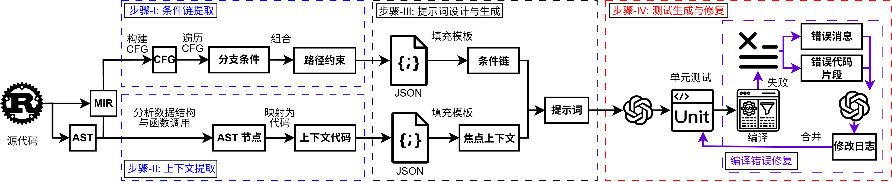
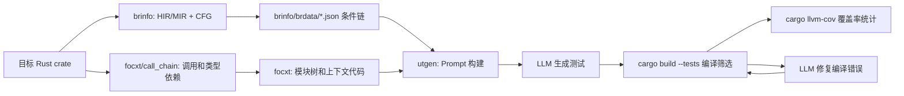
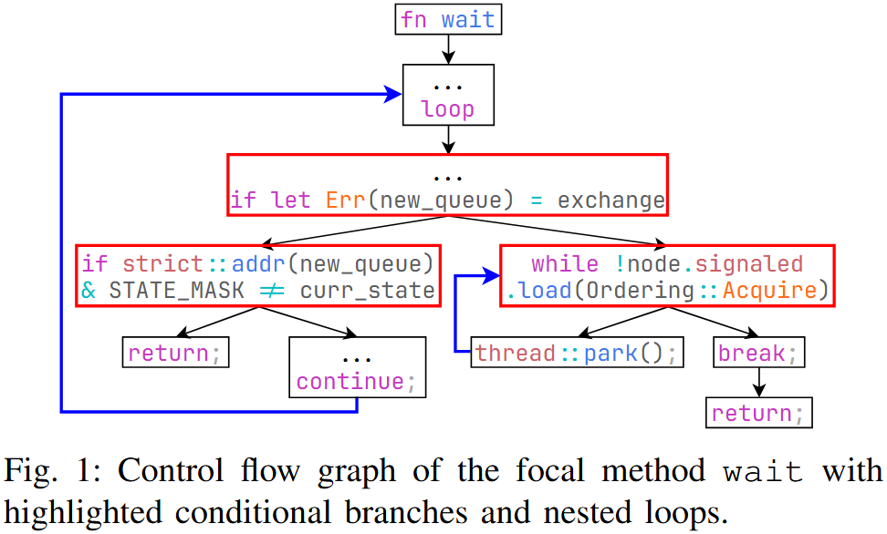
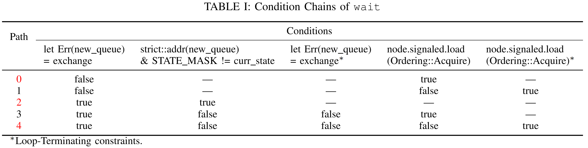
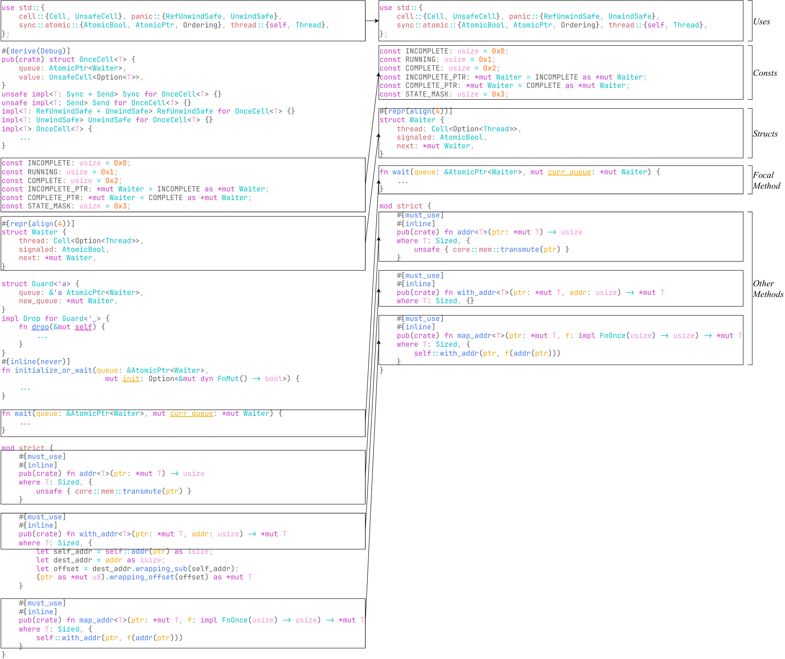
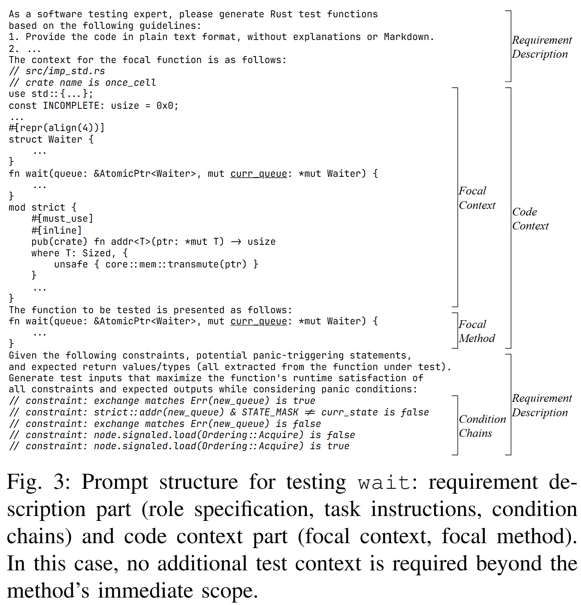
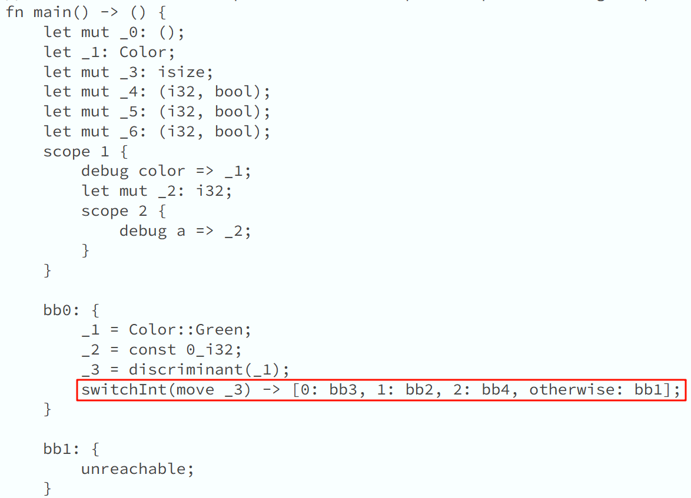
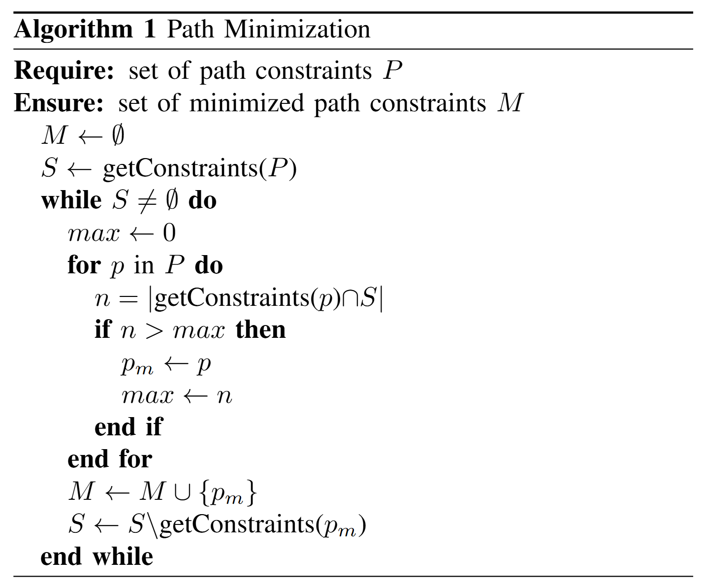
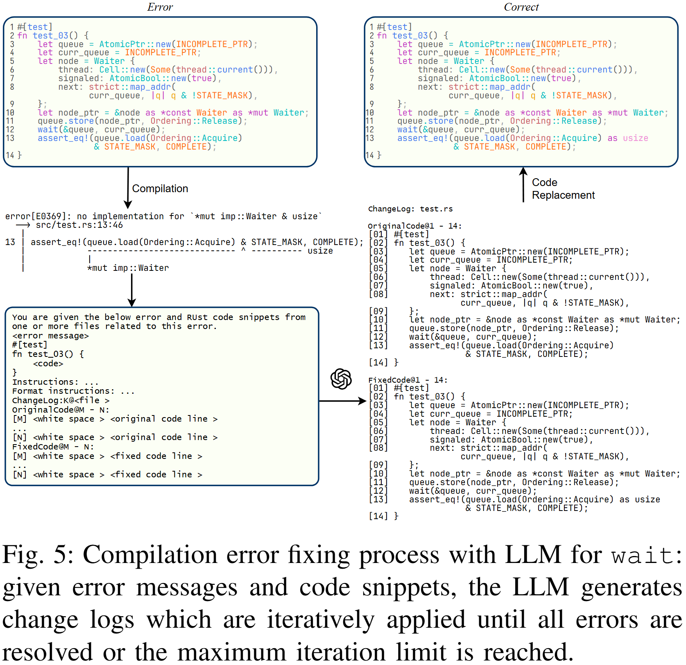

# 基于大模型的 Rust 单元测试生成说明与运行指南

本文重点说明 PALM 的技术路线、各模块职责、数据流和运行步骤。

下文源码路径均相对于 PALM 仓库根目录。指南与配图来自 `rust-utgen/1.87`，命令说明已按当前 PALM 实现校正；版本与整合范围见[来源记录](source-integration.md)，会议展示材料见 [ASE 2025 资料](ase2025/README.md)。

## 1. 项目目标

本项目面向 Rust crate 自动生成单元测试。核心目标是：在给定被测函数的条件链和上下文信息后，利用大语言模型生成更容易通过编译、覆盖更多路径的 Rust 测试用例。

Rust 的所有权、借用检查、生命周期、模式匹配、枚举和宏等机制，让单纯依赖源码片段的大模型测试生成很容易出现两类问题：

- 编译通过率不足：模型生成的代码可能违反所有权、借用或可见性规则。
- 覆盖率不足：模型难以仅凭源码表面判断复杂分支的路径约束，尤其是 `match`、`if let`、`?`、解构和 panic 相关路径。

PALM 的思路是把程序分析纳入提示词构建过程：先用 Rust 编译器中间表示提取路径条件，再用源码 AST 和调用链补齐上下文，最后让模型按路径生成测试，并在编译失败时迭代修复。

## 2. 总体技术路线



整体流程可以概括为四步：

1. 条件链提取：`brinfo` 通过 rustc API 同时获取 HIR 和 MIR，构建 CFG，遍历执行路径，恢复源码级条件，并输出每个函数的条件链。
2. 上下文构建：`focxt` 和 `focxt/call_chain` 分析函数调用、使用到的类型、模块树和可见性，生成面向提示词的上下文代码片段。
3. 提示词生成：`utgen` 读取条件链、函数源码、上下文和提示词模板，构造完整测试生成任务。
4. 测试生成与修复：`utgen` 调用 LLM 生成测试，临时插入项目运行 `cargo build --tests` 和 `cargo llvm-cov`，再用编译错误驱动 LLM 修复失败测试。



## 3. 核心概念

### 3.1 条件链

条件链是被测函数某一条执行路径上的约束集合。它通常包含：

- `cond`：源码级条件表达式，例如 `x > 0` 或 `color matches Color::Red`。
- `value`：该路径上条件取值，例如 `true`、`false`、`Ok/Some`、`Err/None`。
- `line`：条件所在源码行。
- `bound`：边界提示，例如 `<` 取反时可推导出的等值边界。
- `may_panic`：是否为潜在 panic 触发点。
- `ret`：路径到达出口时的返回值或返回表达式信息。
- `path`：MIR 基本块路径。
- `may_contra`：条件链内是否存在同一条件的矛盾取值。
- `min_set`：路径最小化后是否被选为用于生成测试的代表路径。





### 3.2 上下文

上下文是为了帮助 LLM 正确构造 Rust 测试而补充的代码片段，主要包括：

- 被测函数所在模块的 `use`、常量、静态变量、类型别名、宏等基础信息。
- 被测函数本身。
- 被测函数所属结构体、枚举、union、trait 或 impl 的声明。
- 被测函数直接调用的函数或方法。
- 参数、返回值、字段和泛型约束涉及的类型。
- 递归依赖的声明信息，避免提示词过大。



### 3.3 按路径分解生成

“分解测试生成任务”指的是按被测函数的执行路径分解：`brinfo` 为每个函数提取多条条件链，路径最小化后将 `min_set = true` 的条件链作为代表路径，`utgen` 再针对每条代表路径分别构造约束提示并生成测试。也就是说，任务分解的基本单元是“条件链/执行路径”。

`utgen` 在实现上支持两种生成方式：

- 完整测试生成：一次性要求 LLM 生成完整 `#[test]` 函数。
- 可选三段式生成：先推断输入范围，再生成测试前缀，最后独立生成断言 oracle，由 `--oracle` 开启。该模式属于实现中的实验选项，不等同于前面所说的按路径任务分解。本指南的基本流程使用完整测试生成。

两种实现方式都可以通过 `--requirement` 控制是否把条件链加入提示词，通过 `--context` 控制是否把上下文代码加入提示词。PALM 的关键技术路线是 `--requirement` 带来的按路径约束生成，以及 `--context` 带来的依赖上下文补全。



## 4. Workspace 结构

| 路径 | 作用 |
| --- | --- |
| `brinfo/` | 条件链提取工具。通过 rustc driver 获取 HIR/MIR，构建 CFG，输出路径约束。 |
| `focxt/call_chain/` | 调用链和类型依赖提取工具。作为 `cargo call-chain` 运行，输出每个函数的调用和类型信息。 |
| `focxt/` | 上下文构建工具。解析模块树、use、类型、impl、trait 和函数，生成提示词上下文代码。 |
| `utgen/` | 测试生成、编译筛选、覆盖率统计和 LLM 修复工具。 |
| `build-utils/` | 构建辅助模块，供依赖 rustc_private 的 crate 在 build script 中使用。 |
| `examples/bytes/` | 来自 `tokio-rs/bytes` 的独立被测示例，排除在工具 workspace 之外。 |
| `docker/` | Docker 构建和运行脚本，用于不想在本机配置 Rust nightly 的场景。 |
| `install.sh` | 默认安装 `brinfo`、`focxt/call_chain`、`focxt` 和 `utgen`。 |

## 5. `brinfo` 模块说明

`brinfo` 是条件链提取模块。它通过 `cargo brinfo` 包装 Cargo 编译流程，只对目标 crate 执行分析，对依赖 crate 则转交给真实 rustc 编译。

### 5.1 入口与运行机制

- `brinfo/src/bin/cargo-brinfo.rs`
  - 实现 `cargo brinfo` 子命令。
  - 读取当前 crate 的 Cargo metadata。
  - 对 lib/bin target 执行 `cargo check`。
  - 设置 `RUSTC_WRAPPER` 指向自身，使编译过程回到 `cargo-brinfo`。
  - 通过 `BRINFO_TOP_CRATE_NAME` 判断当前 rustc 调用是否属于目标 crate。
  - 对目标 crate 调用 `brinfo`，对依赖 crate 设置 `BRINFO_BE_RUSTC=1` 让它表现为普通 rustc。

- `brinfo/src/bin/brinfo.rs`
  - 真正的 rustc driver 分析入口。
  - 自动补充 sysroot。
  - 对目标 crate 添加 `-Zalways_encode_mir`，确保可获取 MIR。
  - 添加 `-Cpanic=abort` 简化 CFG。
  - 从 `BRINFO_CRATE_DIR` 获取目标 crate 目录。
  - 注册 `BrInfoCallbacks` 执行分析。

### 5.2 HIR 条件识别

- `brinfo/src/analysis/hirvisitor.rs`
  - 遍历 HIR 顶层模块和函数。
  - 跳过自动派生函数和无法用 `syn::Item` 解析的非普通函数片段。
  - 记录函数完整名称、impl 名称、可见性、文档注释、源码位置、函数源码和 MIR basic blocks。
  - 为每个函数分配基于 `twox-hash` 和 `base62` 的 `encoded_name`。

- `brinfo/src/analysis/branchvisitor.rs`
  - 从 HIR 中识别条件语义并建立 `SourceInfo -> Condition` 映射。
  - 支持布尔表达式、二元比较、`if let`、`match`、`for` 循环、`?` desugar、潜在 panic 调用等。
  - 对 `match` 模式会识别枚举、结构体/元组结构体、tuple、字面量和 wildcard。
  - 额外识别 `unwrap`、`expect`、`unchecked` 以及部分标准库方法可能导致的 panic。

### 5.3 MIR CFG 路径遍历

- `brinfo/src/analysis/fnblocks.rs`
  - 将 MIR basic blocks 转换为自定义 `MyBlock`，记录前驱、后继、语句和终结符。
  - 基于 dominator 识别循环，限制重复 loop path，避免无穷遍历。
  - 处理 `TerminatorKind::SwitchInt` 时，根据 HIR 条件映射恢复源码级约束。
  - 处理 `FalseEdge` 时补充 match arm 相关约束。
  - 处理 `Call` 时记录潜在 panic 条件。
  - 到达出口块时生成 `CondChain`，并记录路径和返回表达式。

Rust 的一个核心挑战是 MIR 的去糖。比如高级语法 `match color` 可能在 MIR 中表现为整数判别值比较，大模型直接看到 `_3 == 0` 这类底层条件并不容易生成有意义的测试。项目通过 HIR 的模式信息和 MIR 的 Span、判别值、字段投影等信息，把底层条件恢复成源码语义。



### 5.4 路径最小化

函数路径数量会随分支指数级增长。`BrData::set_min_set` 使用贪心集合覆盖近似算法选择代表路径：

1. 收集所有条件链覆盖的条件集合。
2. 优先从非矛盾路径中选择覆盖未覆盖条件最多的路径。
3. 若还有未覆盖条件，再从可能矛盾路径中补充。
4. 将被选路径标记为 `min_set = true`。



### 5.5 `brinfo` 输出产物

在目标 crate 目录下生成：

| 输出 | 说明 |
| --- | --- |
| `brinfo/name_map.json` | 函数完整名到 `encoded_name` 的映射。 |
| `brinfo/brdata/<encoded>.json` | 每个函数的条件链、源码、位置、可见性和路径最小化信息。 |
| `brinfo/tmp/<encoded>/code.rs` | 被测函数源码片段。 |
| `brinfo/tmp/<encoded>/hir.txt` | HIR 调试输出。 |
| `brinfo/tmp/<encoded>/mir.txt` | MIR basic blocks 和 terminator 调试输出。 |
| `brinfo/tmp/<encoded>/cond_map.json` | HIR 条件映射结果。 |
| `brinfo/tmp/<encoded>/cfg.dot` | CFG dot 图。 |

## 6. `focxt/call_chain` 模块说明

`focxt/call_chain` 负责从编译器层面提取函数调用和类型依赖，安装后提供 `cargo call-chain`。

主要文件：

- `focxt/call_chain/src/bin/cargo-call-chain.rs`
  - 与 `cargo-brinfo` 类似，是 Cargo 子命令包装器。
- `focxt/call_chain/src/bin/call-chain.rs`
  - rustc driver 分析入口。
- `focxt/call_chain/src/analysis/hirvisitor.rs`
  - 遍历函数，记录函数名、所属模块、impl/trait 信息、完整名和 `encoded_name`。
- `focxt/call_chain/src/analysis/callback.rs`
  - 遍历 MIR basic blocks 中的 `TerminatorKind::Call`，提取调用函数。
  - 遍历 local declarations 和调用参数，递归收集 ADT、数组、切片、裸指针、tuple 等类型的子类型。

输出在目标 crate 的 `focxt/` 目录下：

| 输出 | 说明 |
| --- | --- |
| `focxt/callsandtypes/<encoded>.json` | 每个函数的直接调用和类型依赖。 |
| `focxt/basic_blocks/<encoded>.txt` | basic blocks 和 locals 调试信息。 |
| `focxt/impl_informations.json` | 函数所属模块、函数名、结构体名、trait 名、完整名和编码名。 |

## 7. `focxt` 模块说明

`focxt` 将调用/类型依赖转换为可放入提示词的上下文代码。

### 7.1 入口流程

`focxt/src/main.rs` 的流程是：

1. 解析 `--crate <CRATE_PATH>`。
2. 执行 `run_call_chain`，先 `cargo clean`，再在目标 crate 下运行 `cargo call-chain`。
3. 读取 `focxt/impl_informations.json`。
4. 创建 `CrateContext` 并解析 crate。
5. 建立模块树和完整名称。
6. 生成扩展后的调用/类型依赖。
7. 为每个函数输出上下文 `.rs` 文件。

### 7.2 模块树与 AST 上下文

- `focxt/src/collect_context/crate_context.rs`
  - 读取 `Cargo.toml` 获取 crate 名。
  - 识别 `src/main.rs` 和 `src/lib.rs` 入口。
  - 组织多个 `ModContext`。
  - 输出模块树、函数名清单、调试上下文。

- `focxt/src/collect_context/mod_context.rs`
  - 表示一个模块或函数内嵌模块的上下文。
  - 递归解析 inline mod、文件 mod、`#[path = "..."]` mod。
  - 处理父模块、crate 模块、lib 模块关系。
  - 递归更新 use tree、impl 名称和完整函数名。

- `focxt/src/collect_context/syntax_context.rs`
  - 使用 `syn` 解析并保存 const、macro、trait alias、use、mod、static、type、struct、enum、union、impl、function、trait。
  - 删除文档属性，减少提示词噪音。
  - 展开 `use` tree，处理 `pub`、`pub(super)`、`pub(in ...)`、私有可见性。
  - 根据 call-chain 输出的 calls/types，从函数表和类型表中找出相关定义。
  - 对递归依赖使用声明或简化信息，控制上下文大小。
  - 用 `prettyplease` 格式化输出 Rust 代码。

### 7.3 `focxt` 输出产物

在目标 crate 目录下生成：

| 输出 | 说明 |
| --- | --- |
| `focxt/<encoded>.rs` | 每个函数对应的提示词上下文代码，供 `utgen` 读取。 |
| `focxt/new_callsandtypes/<encoded>.json` | 扩展和补全后的调用/类型依赖。 |
| `focxt/result.txt` | 解析得到的函数表和结构体/trait/enum/union 表调试输出。 |
| `focxt/context.txt` | 整个 `CrateContext` 调试输出。 |
| `focxt/mod_trees/mod_tree*.txt` | 模块树列表。 |
| `focxt/functions/function*.txt` | 完整函数名列表。 |

## 8. `utgen` 模块说明

`utgen` 是生成和执行测试的主模块。

### 8.1 CLI 子命令

源码中的 CLI 定义在 `utgen/src/main.rs`，当前支持：

```text
utgen pre-process --project-dir <PROJECT_DIR> [--work-dir <WORK_DIR>...]
utgen analyze --project-dir <STANDALONE_CRATE_DIR>
utgen gen --project-dir <PROJECT_DIR> [--work-dir <WORK_DIR>...] [--tasks <N>] [--integration] [--requirement] [--context] [--oracle]
utgen fix --project-dir <PROJECT_DIR> [--work-dir <WORK_DIR>...] [--tasks <N>]
```

`analyze` 现在执行 `cargo clean`、`cargo brinfo` 和 `focxt`，随后核对分析索引及上下文文件。当前支持用 `-p` 指定单个独立 crate；目录中已有 `brinfo/` 或 `focxt/` 时会拒绝执行，应使用新的工作副本，避免混入旧分析结果。

参数含义：

| 参数 | 说明 |
| --- | --- |
| `-p, --project-dir` | 项目根目录。路径会相对于当前目录解析并 canonicalize。 |
| `-w, --work-dir` | 工作目录，可重复传入或用逗号分隔，相对路径基于当前命令执行目录，默认等于 project dir。 |
| `-t, --tasks` | 默认 `4`，必须大于 `0`。生成和修复均限制同时活跃的被测函数任务数；同一函数内的条件链、生成阶段或修复轮次依次执行。 |
| `--functions-file` | 可选 UTF-8 函数清单，每行一个 `brinfo/name_map.json` 中的完整名称。生成、修复及其统计均按清单筛选；空行忽略、重复项去重，不支持通配符。 |
| `--max-requests` | 可选的整次命令请求尝试次数上限，必须大于 `0`；默认不设总上限。所有并发任务和重试共享该额度。 |
| `-i, --integration` | 生成集成测试，放到 `tests/` 目录，按分析结果的 `visible` 标志筛选函数并进行编译检查。 |
| `-r, --requirement` | 在提示词中加入条件链约束。 |
| `-c, --context` | 在提示词中加入 `focxt/<encoded>.rs` 上下文。 |
| `-o, --oracle` | 开启三段式生成：输入范围、测试前缀、oracle 分别生成。该模式是可选实验模式，不是按路径任务分解本身。 |

`--requirement`、`--context` 和 `--oracle` 默认均关闭。即使不传 `--context`，当前生成器仍读取 focxt 索引和对应的上下文文件；该参数只控制是否把上下文加入提示词。

生成任务取得名额后才开始工作，将结果送入容量为 N 的队列后释放名额；串行消费者负责导入检查和候选编译。队列中的结果及正在验证的候选不占生成名额。修复任务则在该函数的修复结果保存后释放名额。源码插入、target 清理、编译或测试、诊断读取及源码恢复串行执行，模型请求可以重叠；该参数不改变 Cargo 内部的依赖编译并行度。同一工作副本不能供多个 PALM 进程同时使用，不同实验应使用独立副本和 target 目录。

任务异常会在等待所有任务结束后报告，并跳过后续覆盖率统计。修复成功时只删除本次创建的备份；任务失败时恢复源码并保留这些备份，已有备份不会被覆盖。候选本身编译不通过仍按测试结果处理。模型请求现在统一执行：`--request-timeout` 默认每次尝试 180 秒，包含响应体读取；网络错误、429（余额不足除外）和 5xx 最多尝试 3 次，其他 HTTP 错误或空回答直接报错。格式纠正和编译修复轮次单独计算，不再叠加网络重试。缺少 `usage` 的有效回答可以继续，但请求统计标记为不完整；生成和修复分别写入 `utgen/generation/gen-requests.json`、`fix-requests.json`。该期限不涵盖 Cargo 子进程，也不提供跨进程锁或强制终止恢复。

小规模试跑可在 `gen`、`fix` 中分别传入同一份 `--functions-file`，不会自动沿用上次清单。空清单和未知名称在修改目标前报错；修复时缺少所选函数的候选结果也会报错。`--max-requests` 包含所有并发任务、生成阶段、格式纠正、修复轮次及网络重试的请求尝试，计数与额度检查使用同一个共享计数器。额度用完且仍需请求时，命令失败，等待已有请求收尾并恢复源码；恰好用完额度且工作全部完成则成功。请求报告记录模型、选项、去重后的函数清单、候选处理状态和用量；候选状态不等于测试通过或覆盖率统计完成。未选函数的已有文件保留，跨实验应使用新副本。[2 函数和 8 函数清单及操作说明](../examples/README.md#prepare-a-small-model-trial)提供限定函数范围和请求额度的用法；先检查请求报告，再查看对应函数的编译、执行和覆盖率统计。

### 8.2 LLM 配置

`utgen/src/gene/llm.rs` 保留 `async-openai` 的请求／响应类型，通过 `reqwest` 调用兼容 OpenAI Chat Completions 的接口，统一管理重试。模型配置由 `utgen/src/config.rs` 在运行时加载；可以复制 `utgen/res/api.example.json` 并填写为：

```text
utgen/res/api.json
```

内容格式：

```json
{
  "base": "https://xxxx/v1",
  "key": "sk-xxxxxxxxxx",
  "model": "xxx"
}
```

使用 `--config <配置路径>` 显式指定配置文件，未指定时读取 `PALM_CONFIG` 指向的文件。`PALM_API_BASE`、`PALM_API_KEY`、`PALM_MODEL` 分别覆盖文件中的字段，也可以单独提供完整配置。选中的文件不可读或格式错误时会报错，最终三个字段都必须非空。相对配置路径基于命令执行目录；不会自动搜索当前目录或安装目录下的 `api.json`。

构建、安装、帮助、预处理和分析不需要模型配置。`gen` 和 `fix` 在开始处理目标项目之前加载并检查配置；修改地址、密钥或模型后，下次命令运行立即生效，不需要重新编译。建议从仓库根目录设置绝对路径：

```sh
export PALM_CONFIG="$(pwd)/utgen/res/api.json"
```

当前 PALM 请求固定使用非流式输出、单个回答，并设置 `max_tokens=10000`。采样使用所选模型的默认设置，不再发送写死的 `temperature=1.0` 和 `top_p=0`，以兼容拒绝这些可选参数的服务。

### 8.3 Prompt 构建

提示词模板位于 `utgen/res/`：

| 文件 | 用途 |
| --- | --- |
| `input_prompt.json` | 三段式模式中推断输入范围。 |
| `prefix_prompt.json` | 三段式模式中生成没有断言的测试前缀。 |
| `oracle_prompt.json` | 三段式模式中根据测试前缀生成断言。 |
| `test_prompt.json` | 一次性生成完整测试。 |
| `rustassistant_prompt.json` | 修复编译错误时生成 ChangeLog。 |
| `code_template.json` | 单元测试插入源码时的 `#[cfg(test)] mod llmtests` 模板。 |

`PromptBuilder` 会把以下信息拼接成最终 prompt：

- 系统角色和任务要求。
- 是否为 integration test 的额外约束。
- `focxt/<encoded>.rs` 上下文代码。
- 被测函数文件名、crate 名、文档注释和源码。
- 条件链约束、返回值信息和 may panic 提示。
- 集成测试模式下的 `use` 参考路径。

### 8.4 测试生成流程

核心文件：

- `utgen/src/gene/mod.rs`
  - `gen_tests_project` 读取 `brinfo/brdata`、`brinfo/name_map.json` 和 `focxt/impl_informations.json`。
  - 为每个函数创建异步生成任务。
  - integration 模式会跳过 `visible=false` 的函数。该标志基于从 crate 根访问的可见性，最终候选仍需通过集成测试编译检查。
  - 调用 `check_unit` 或 `check_integration` 对候选测试做编译筛选。
  - 生成结果写入 `utgen/generation/pre_fix/<encoded>.json`。
  - 若该 JSON 已存在，则跳过对应函数；缓存不会因模型、提示词或生成参数变化而自动失效。

- `utgen/src/gene/generation.rs`
  - `generation_tests` 根据 `--oracle` 选择三段式生成或完整生成。
  - `gen_full_tests` 使用 `test_prompt.json` 一次性生成测试。
  - `gen_tests_cot` 使用 `input -> prefix -> oracle` 三步流程。
  - `check_unit` 会临时把测试插入被测源码文件，运行 `cargo build --tests`，记录每个候选是否可编译，然后恢复文件。
  - `check_integration` 会写入 `tests/test_check.rs` 做编译检查。

- `utgen/src/gene/cot/*.rs`
  - `input_infer.rs`：生成输入范围。
  - `prefix_gen.rs`：生成测试前缀，并用 `syn` 解析出 `#[test]` 函数、use 和 common code。
  - `oracle_gen.rs`：生成断言。
  - `test_gen.rs`：完整测试生成。

### 8.5 测试提取与插入

- `utgen/src/gene/test_ext.rs`
  - 用 `syn` 解析 LLM 返回代码。
  - 提取 `use` 语句、`#[test]` 函数、测试模块、公共辅助代码。
  - 要求 LLM 返回可被 `syn::File` 解析且至少包含一个当前支持的 `#[test]` 函数的 Rust 代码；语法错误与未提取到测试均返回明确原因。

完整测试和 prefix 生成共用这次解析与提取，失败时沿用最多 3 次的格式尝试，耗尽后报告生成失败并跳过后续统计。这里只判断是否存在测试候选；prefix 阶段允许没有断言，候选能否编译和通过由后续执行判断。每次收到的原始回答先保存在 `utgen/generation/answer/<encoded>/<chain>/test-attempt-N.txt` 或 `prefix-attempt-N.txt`，再移除代码围栏并解析；成功代码仍保存为 `code.rs` 或 `prefix.rs`。尝试文件路径会在后续命令中复用，不构成多轮实验历史；旧候选缓存也不会自动迁移，验收使用新的工作副本。

- `utgen/src/utils/insert.rs`
  - 根据 `InsertKind` 把测试插入文件末尾或模块末尾。

- `utgen/src/types/testgen.rs`
  - `TestGenInfo` 表示一个被测函数的所有测试生成结果。
  - `ChainTestInfo` 表示一条条件链对应的输入推断、prompt 约束和答案。
  - `ChainTestAnswer` 表示一次 LLM 答案的 use、common code 和测试列表。
  - `TestInfo` 表示一个测试的属性、前缀、oracle、候选代码、编译结果和修复状态。

### 8.6 覆盖率与通过率统计

核心文件：

- `utgen/src/run/run.rs`
  - `run_test` 在覆盖率模式下执行：

    ```sh
    cargo llvm-cov --tests --ignore-run-fail --branch --cobertura --output-path coverage.xml
    cargo llvm-cov report --json --output-path coverage.json
    ```

  - 错误模式下执行：

    ```sh
    cargo test --tests --message-format json
    ```

  - `gen_test_rate` 读取生成结果，运行覆盖率，计算每个被测函数的测试数、编译通过数、运行通过数、行覆盖和分支覆盖。

- `utgen/src/run/coverage.rs`
  - 覆盖率入口复用预处理的测试识别规则，在测试模块、独立测试函数及 `cfg(test)` 辅助函数/方法前临时添加 `#[coverage(off)]`。整个测试模块（含生成的 `llmtests`）排除后，其中的辅助代码默认不计入覆盖率分子和分母；测试专用 `impl` 按方法处理，带文件级 `#![cfg(test)]` 的模块整文件排除。被调用的生产函数仍参与统计。
  - 已有 coverage 属性和 feature 开关予以复用；条件属性只在原条件不成立时补充，条件由编译器判断，显式 `coverage(on)` 保留。在 crate 根文件同一行临时开启 `coverage_attribute`，保持原行号，不覆盖编译 flags。成功或编译/导出报错返回前恢复源文件原始内容；强制终止后的恢复留待后续处理。
  - 测试只执行一次，先输出 XML，再由 `report --json` 导出同一份运行数据。第一条命令保留默认清理，避免候选之间累积旧覆盖率。
  - `utgen coverage -p <原始 crate 工作副本>` 可在预处理前测量原有测试，无需模型配置和分析产物；结果保留在该副本的 `coverage.xml`、`coverage.json`。断言失败仍导出覆盖率，编译或报告错误则返回失败。当前支持源码位于 `src/` 的独立 crate，非入口文件若是合法表达式片段（如 `include!` 引入的表达式），预处理与覆盖率均原样保留，不自动改写片段内部的测试代码；入口文件与其他解析错误仍严格检查。不展开宏，也不自动推断未标记的公共辅助函数是否仅用于测试。

- `utgen/src/run/coverage_json.rs`
  - 解析 `coverage.json` 中的 branch 信息。

输出目录：

| 输出 | 说明 |
| --- | --- |
| `utgen/result/<encoded>.json` | 修复前覆盖率和通过率统计。 |
| `utgen/fixed_result/<encoded>.json` | 修复后覆盖率和通过率统计。 |
| `coverage.xml` | `cargo llvm-cov` Cobertura 中间输出，位于目标 work dir，解析后可能被删除。 |
| `coverage.json` | `cargo llvm-cov` JSON 中间输出，位于目标 work dir，解析后可能被删除。 |

最终统计以 `utgen/result/` 和 `utgen/fixed_result/` 中的 JSON 为准；当前实现不生成 HTML 报告。

### 8.7 LLM 修复流程



核心文件：

- `utgen/src/run/llm_fix.rs`
  - 读取 `utgen/generation/pre_fix`，复制或合并到 `utgen/generation/llm_fix`。
  - 对不可编译且未修复的测试，临时插入源码并运行 `cargo test --tests --message-format json`。
  - 解析编译错误，抽取错误相关代码片段。
  - 构造 `rustassistant_prompt.json` 中定义的 ChangeLog 格式要求。
  - 调用 LLM 修复，应用 ChangeLog，重新编译。
  - 每个测试最多尝试若干错误和修复轮次，优先保留错误数量更少的版本。

- `utgen/src/run/llm_fix_type.rs`
  - `CompilerMessage` 对应 Cargo JSON message。
  - `ErrorMessage` 合并错误 span，并抽取前后最多 50 行上下文。
  - `TestCode` 定位测试代码在临时文件中的行号，并应用 ChangeLog。
  - `ChangeLog` 和 `ChangeData` 解析 LLM 返回的 `OriginalCode`/`FixedCode` 块。

## 9. 数据流与目录依赖

运行 `utgen gen` 前必须已有：

```text
<target-crate>/brinfo/name_map.json
<target-crate>/brinfo/brdata/*.json
<target-crate>/focxt/impl_informations.json
<target-crate>/focxt/<encoded>.rs
```

生成阶段会在 project dir 下创建：

```text
utgen/generation/prompt/<encoded>/
utgen/generation/answer/<encoded>/
utgen/generation/pre_fix/<encoded>.json
```

修复阶段会创建或更新：

```text
utgen/generation/llm_fix/<encoded>.json
utgen/fixed_result/<encoded>.json
```

## 10. 运行说明

### 10.1 环境准备

安装 nightly 工具链和组件：

```sh
rustup install nightly-2025-03-19
rustup component add --toolchain nightly-2025-03-19 rust-src rustc-dev llvm-tools-preview
```

安装覆盖率工具：

```sh
cargo +stable install cargo-llvm-cov --version 0.6.16 --locked
```

目标 crate 根目录建议包含：

```toml
[toolchain]
channel = "nightly-2025-03-19"
components = ["rust-src", "rustc-dev", "llvm-tools-preview"]
```

本仓库根目录已经有 `rust-toolchain.toml`，示例项目 `examples/bytes/` 也包含对应配置。

构建和安装无需密钥。运行 `gen`、`fix` 前准备 `utgen/res/api.json`，并按 8.2 节设置 `PALM_CONFIG` 或传入 `--config`：

```json
{
  "base": "https://xxxx/v1",
  "key": "sk-xxxxxxxxxx",
  "model": "xxx"
}
```

### 10.2 安装工具

可以使用脚本：

```sh
./install.sh
```

脚本默认安装：

```text
brinfo
focxt/call_chain
focxt
utgen
```

也可以逐个安装：

```sh
cargo install --path brinfo --locked
cargo install --path focxt/call_chain --locked
cargo install --path focxt --locked
cargo install --path utgen --locked
```

确认 `$HOME/.cargo/bin` 在 `PATH` 中。安装成功后应可运行：

```sh
cargo brinfo --help
focxt --help
utgen --help
```

### 10.3 预处理项目

```sh
utgen pre-process -p <target-crate-path>
```

如果项目是 workspace 或需要只处理部分子目录：

```sh
utgen pre-process -p <project-root> -w <work-dir-1> -w <work-dir-2>
```

预处理会：

- 将所选 crate 根目录的 `tests` 重命名为 `tests.bak`；已有备份不会被覆盖。
- 将 `src` 中测试专属模块，以及带 `#[test]` 或路径末段为 `test` 的属性的函数替换为空白，保持换行和字节位置。

模块识别解析 `cfg` 表达式，仅移除能确定在关闭 `test` 时不可用的模块；保留 `cfg(not(test))`，对未知 feature/target 条件保守处理。预处理修改目标项目源码树，没有完整的反向预处理命令，应在临时副本中运行。先预处理，再对准备好的源码分析；空白替换保持字节位置，UTF-8 字符列号仍应以处理后的源码为准。`-w` 的相对路径基于当前命令执行目录。

### 10.4 对目标 crate 运行程序分析

预处理后，推荐对新的独立 crate 副本执行：

```sh
utgen analyze -p <target-crate-path>
```

也可以手动进入准备好的目标 crate 根目录提取条件链。已有 `cargo check` 缓存可能使编译器包装器不执行，因此需要先清理：

```sh
cargo clean
cargo brinfo
```

然后构建上下文：

```sh
focxt -c <target-crate-path>
```

`focxt` 内部会运行 `cargo call-chain`，因此需要先安装 `focxt/call_chain`。

### 10.5 生成测试

推荐使用条件链和上下文，按代表路径直接生成完整测试：

```sh
utgen gen -p <target-crate-path> --requirement --context
```

生成集成测试：

```sh
utgen gen -p <target-crate-path> --integration --requirement --context
```

如需复现实验性三段式流程，再额外添加 `--oracle`：

```sh
utgen gen -p <target-crate-path> --requirement --context --oracle
```

`utgen gen` 会自动尝试给目标 crate 的 `Cargo.toml` 追加 `ntest` 依赖：

```toml
[dependencies.ntest]
version = "0.9.3"
```

因为生成模板中使用了 `ntest::timeout`。

### 10.6 修复测试

```sh
utgen fix -p <target-crate-path>
```

修复阶段读取 `utgen/generation/pre_fix`，针对不可编译测试调用 LLM 生成 ChangeLog 并重新验证。修复结果写入 `utgen/generation/llm_fix`，覆盖率统计写入 `utgen/fixed_result`。

`fix` 当前将测试插入源码，以单元测试方式修复和统计，没有独立的 integration 修复选项。因此 `gen --integration` 后接 `fix` 并不表示全过程保留集成测试模式。运行时断言失败也不属于当前编译修复流程的目标。

### 10.7 示例：`examples/bytes`

先安装工具，再按前文准备运行时配置 `utgen/res/api.json`。然后从仓库根目录复制 bytes 到临时目录，后续命令在同一个 shell 中执行：

```sh
palm_repo="$(pwd)"
export PALM_CONFIG="$palm_repo/utgen/res/api.json"
palm_example_dir="$(mktemp -d "${TMPDIR:-/tmp}/palm-bytes.XXXXXX")"
cp -R "$palm_repo/examples/bytes/." "$palm_example_dir/"
cd "$palm_example_dir"
utgen pre-process -p "$palm_example_dir"
utgen analyze -p "$palm_example_dir"
```

按单元测试模式生成和修复：

```sh
utgen gen -p "$palm_example_dir" --requirement --context
utgen fix -p "$palm_example_dir"
```

切换到 integration、其他提示词或其他模型时，使用新的目标副本并重新分析，避免复用旧的生成缓存。更详细的示例见 [examples/README.md](../examples/README.md)。当前完整生成与修复回归使用 [minimal 示例](minimal-pipeline.md)。[bytes 分析验收](bytes-analysis.md) 已覆盖默认配置下导出的 663 个函数及其上下文；bytes 的真实模型生成、修复和覆盖率实验仍是后续验证项。

完成后重点查看临时目标目录中的以下路径：

```text
brinfo/brdata/
focxt/
utgen/generation/
utgen/result/
utgen/fixed_result/
```

## 11. 常见问题与排查

### 11.1 `utgen` 提示缺少模型配置

当前版本不再在编译时读取 `api.json`。若 `gen` 或 `fix` 提示缺少 `PALM_API_BASE`、`PALM_API_KEY` 或 `PALM_MODEL`，请按 8.2 节提供配置。例如从仓库根目录执行：

```sh
utgen --config utgen/res/api.json gen -p <target-crate-path> --requirement --context
```

旧版配置文件的三个字段仍可使用，但需要显式选择文件。若构建仍报 `include_str!` 找不到 `api.json`，请核对正在构建的源码版本。

### 11.2 `cargo brinfo` 在 workspace 根目录失败

`cargo-brinfo` 需要定位当前 package。对于 workspace，建议进入具体 crate 目录运行，或者明确使用目标 crate 的 manifest。

### 11.3 `brinfo` 编译失败或找不到 rustc 私有 crate

确认使用 `nightly-2025-03-19`，并安装：

```sh
rust-src rustc-dev llvm-tools-preview
```

这些 crate 使用了 `#![feature(rustc_private)]`，必须依赖 nightly 和 rustc-dev。

### 11.4 `utgen gen` 提示缺少 `brinfo` 或 `focxt` 文件

先确认目标 crate 下存在：

```text
brinfo/name_map.json
brinfo/brdata/*.json
focxt/impl_informations.json
focxt/<encoded>.rs
```

缺少或不一致时，生成器会在修改目标文件之前报错。请准备新的目标副本，再按顺序执行：

```sh
utgen pre-process -p <new-target-copy>
utgen analyze -p <new-target-copy>
```

### 11.5 集成测试生成数量少

integration 模式先按 `brinfo` 的 `visible` 标志筛选函数，并且 `utgen` 会过滤无法编译的 `use`。该标志不等价于外部 crate 可访问性的完整保证，候选还要经过编译检查。如果希望测试源码内部函数，应使用非 integration 的单元测试插入模式。

### 11.6 目标项目被修改

会修改目标项目的步骤包括：

- `utgen pre-process`：重命名所选 crate 的 `tests`，将测试源码区间替换为空白。
- `utgen gen`：可能追加 `ntest` 依赖，写入临时测试文件或插入测试做编译检查。
- `utgen fix`：临时插入测试并恢复，结束时删除备份。

建议用 git 查看差异：

```sh
git status
git diff
```

### 11.7 修改 prompt 或 API 后没有生效

提示词模板仍通过 `include_str!` 编译进二进制，修改模板后需要重新构建或重新安装。模型配置在运行时读取，无需重新编译；请检查 `--config` / `PALM_CONFIG` 选择的文件以及三个字段环境变量是否覆盖了文件内容。已有生成缓存不会因配置变化失效，切换配置后应使用新的目标副本。

## 12. 推荐阅读顺序

如果要继续维护或扩展项目，建议按以下顺序读源码：

1. `README.md`、`brinfo/README.md`、`focxt/README.md`、`utgen/README.md`
2. `brinfo/src/bin/cargo-brinfo.rs`
3. `brinfo/src/analysis/hirvisitor.rs`
4. `brinfo/src/analysis/branchvisitor.rs`
5. `brinfo/src/analysis/fnblocks.rs`
6. `focxt/call_chain/src/analysis/callback.rs`
7. `focxt/src/collect_context/crate_context.rs`
8. `focxt/src/collect_context/mod_context.rs`
9. `focxt/src/collect_context/syntax_context.rs`
10. `utgen/src/main.rs`
11. `utgen/src/gene/generation.rs`
12. `utgen/src/run/llm_fix.rs`

这条阅读路线基本对应 PALM 的完整数据流：编译器分析、上下文构建、提示词生成、测试执行和修复。
